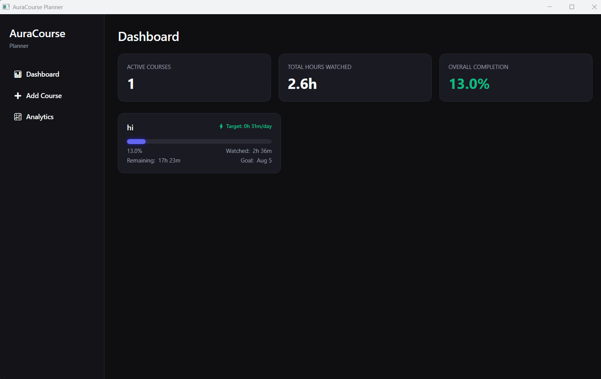
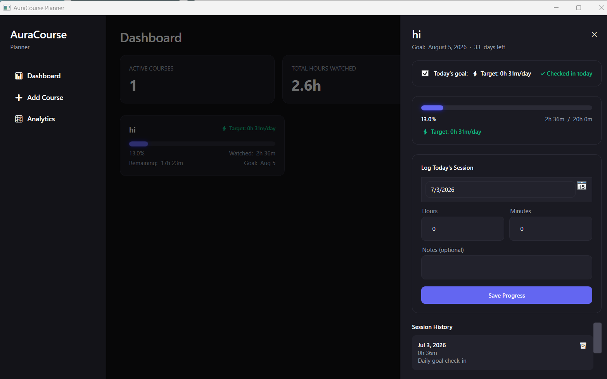
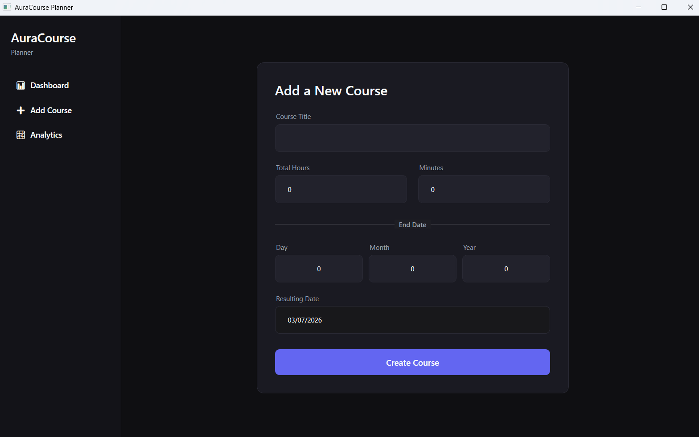
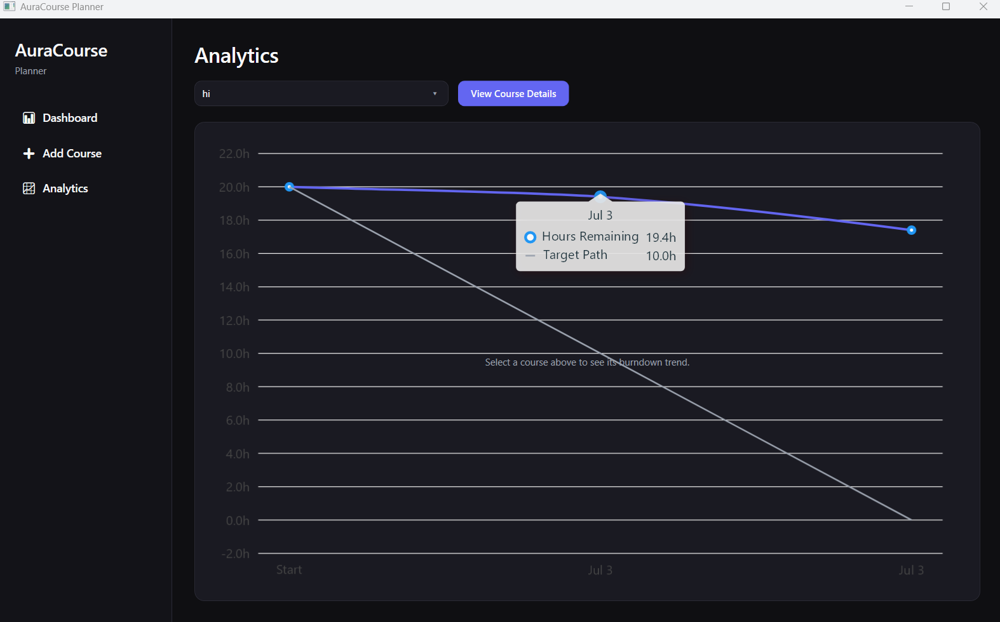

# 🚀 AuraCourse Planner

<div align="center">

### **The Pacing Engine for Your Learning Journey**

*A premium desktop application for tracking courses, managing study sessions, and predicting learning progress.*


---

**AuraCourse Planner** is a modern, elegant and fully offline **WPF** desktop application built for students, developers, and lifelong learners who want complete control over their learning journey.

Featuring a premium dark UI, intelligent pacing engine, interactive analytics, and local-first architecture, AuraCourse Planner helps you stay consistent and finish courses on time.

</div>

---

# 📸 Project Showcase

| Dashboard | Session Tracking |
|:---------:|:----------------:|
|  |  |
| **Modern Dashboard** with overall statistics and active courses. | Easily log study sessions and keep daily progress up to date. |

| Smart Add Course | Analytics |
|:----------------:|:---------:|
|  |  |
| Create courses with validation and automatic calculations. | Beautiful burndown charts and progress analytics powered by LiveCharts2. |

---

# ✨ Features

## 📚 Course Management

- Create unlimited courses
- Track total course duration
- Remaining hours calculation
- Deadline management
- Progress percentage
- Custom daily goals
- Archive completed courses

---

## ⏱ Study Session Tracking

- Log every study session
- Track daily learning time
- Automatic progress updates
- Study history
- Session statistics
- Remaining workload calculation

---

## 🧠 Intelligent Pacing Engine

AuraCourse Planner contains a smart scheduling engine that continuously adapts your learning pace.

### 📈 Dynamic Daily Pace

The application automatically calculates the amount of study required every day using:

```text
Required Daily Hours =
Remaining Course Hours
────────────────────────
Remaining Days
```

If you miss one or more days, the required pace automatically increases to keep you on schedule.

---

### 🔮 Intelligent Completion Prediction

Instead of assuming perfect consistency, AuraCourse Planner predicts your completion date using your actual learning behavior.

The prediction engine uses:

- Rolling 7-day average
- Recent study consistency
- Remaining workload
- Remaining calendar days

If the prediction exceeds your deadline, the application displays an elegant warning indicator.

---

### 🔄 Auto-Fill Persistence

Forgot to check in today?

No problem.

If midnight passes without a study session, AuraCourse Planner automatically fills the missing day with the planned daily target, ensuring charts and analytics remain accurate and continuous.

---

# 📊 Analytics

Built using **LiveCharts2**, the analytics dashboard includes:

- 📈 Burndown Chart
- 📊 Overall Progress
- ⏳ Remaining Hours
- 📅 Daily Study Trend
- 🔥 Learning Streak
- 🎯 Deadline Projection
- 📉 Remaining Work Curve

---

# 🎨 User Experience

Designed with a premium desktop experience in mind.

### Modern UI

- Dark Mode
- Glass-inspired design
- Smooth animations
- Rounded controls
- Professional typography
- Accent color system

### Productivity

- Keyboard-friendly
- Fast navigation
- Responsive layouts
- Clean MVVM architecture
- Offline-first experience

---

# 🏗 Project Structure

```text
AuraCoursePlanner
│
├── Converters
│   └── XAML Value Converters
│
├── Data
│   └── AuraDbContext
│
├── Models
│   ├── Course
│   └── StudySession
│
├── Services
│   ├── Analytics
│   ├── Database
│   └── Pacing Engine
│
├── Themes
│   ├── Colors
│   ├── Styles
│   └── Typography
│
├── ViewModels
│   ├── MainViewModel
│   ├── DashboardViewModel
│   └── CourseViewModel
│
├── Views
│   ├── Dashboard
│   ├── Course Details
│   └── Add Course
│
├── App.xaml
├── App.xaml.cs
└── AuraCoursePlanner.csproj
```

---

# 🛠 Tech Stack

| Technology | Description |
|------------|-------------|
| **.NET 9** | Desktop framework |
| **WPF** | Windows Presentation Foundation |
| **C#** | Programming Language |
| **MVVM** | Application Architecture |
| **CommunityToolkit.Mvvm** | MVVM Toolkit |
| **Entity Framework Core** | ORM |
| **SQLite** | Local Database |
| **LiveCharts2** | Charts & Analytics |

---

# 🚀 Getting Started

## Clone Repository

```bash
git clone
```

---

## Navigate

```bash
cd AuraCoursePlanner
```

---

## Restore Packages

```bash
dotnet restore
```

---

## Build

```bash
dotnet build
```

---

## Run

```bash
dotnet run
```

---

# 💾 Database

AuraCourse Planner stores all data locally.

```text
%AppData%
└── AuraCoursePlanner
    └── aura.db
```

No cloud account.

No internet connection.

Your data always stays on your computer.

---

# 📦 Dependencies

- CommunityToolkit.Mvvm
- Microsoft.EntityFrameworkCore
- Microsoft.EntityFrameworkCore.Sqlite
- LiveChartsCore.SkiaSharpView.WPF

---

# 🎯 Future Roadmap

- [ ] Pomodoro Timer
- [ ] Cloud Synchronization
- [ ] Weekly Reports
- [ ] Calendar View
- [ ] Achievement System
- [ ] Course Categories
- [ ] Import / Export
- [ ] Backup Manager
- [ ] Light Theme
- [ ] Notifications
- [ ] Multiple Profiles
- [ ] AI Study Recommendations

---

# 🤝 Contributing

Contributions, feature requests, and suggestions are always welcome.

Feel free to fork the repository and submit a Pull Request.

---

# 📄 License

This project is licensed under the MIT License.

---

<div align="center">

## ⭐ If you like this project, consider giving it a star!

**Built with ❤️ using .NET, WPF and MVVM**

</div>